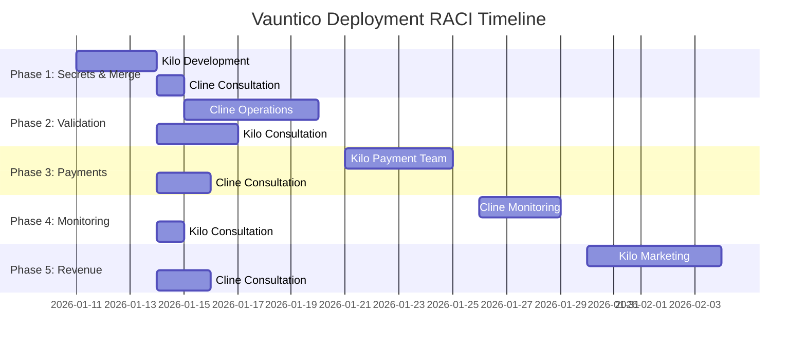

# VAUNTICO DEPLOYMENT RESPONSIBILITY MATRIX (RACI)

## 🎯 Overview

**Document Version**: 1.0
**Prepared By**: Kilo Code
**Date**: 2026-01-11
**Status**: Active

This RACI matrix clearly defines roles and responsibilities for the Kilo/Cline deployment workflow. RACI stands for:

- **Responsible**: Who performs the work
- **Accountable**: Who ensures the work is completed successfully
- **Consulted**: Who provides input and feedback
- **Informed**: Who needs to be kept updated on progress

---

## 📊 RACI Matrix by Deployment Phase

### Phase 1: Secrets & Merge

| Task                            | Responsible           | Accountable             | Consulted        | Informed  |
| ------------------------------- | --------------------- | ----------------------- | ---------------- | --------- |
| Generate cryptographic secrets  | Kilo Security Team    | Kilo DevOps Lead        | Cline Security   | All Teams |
| Document secrets generation     | Kilo Technical Writer | Kilo Documentation Lead | Cline Compliance | Dev Team  |
| Configure environment variables | Kilo DevOps           | Kilo DevOps Lead        | Cline Operations | QA Team   |
| Prepare PR #7 for merge         | Kilo Development      | Kilo Engineering Lead   | Cline QA         | PM Team   |
| Verify merge requirements       | Kilo QA               | Kilo QA Lead            | Cline Operations | Dev Team  |
| Update deployment documentation | Kilo Technical Writer | Kilo Documentation Lead | Cline Training   | All Teams |

**Phase Owner**: Kilo Development Team
**Handoff Approver**: Cline Operations Lead

---

### Phase 2: Validation

| Task                         | Responsible            | Accountable              | Consulted         | Informed     |
| ---------------------------- | ---------------------- | ------------------------ | ----------------- | ------------ |
| Execute frontend validation  | Cline QA Team          | Cline QA Lead            | Kilo Frontend Dev | PM Team      |
| Perform payment flow tests   | Cline Payment Ops      | Cline Payment Lead       | Kilo Payment Dev  | Finance      |
| Configure monitoring systems | Cline Monitoring Team  | Cline Monitoring Lead    | Kilo DevOps       | Support      |
| Test alerting mechanisms     | Cline Operations       | Cline Ops Lead           | Kilo DevOps       | Support Team |
| Validate reporting structure | Cline Analytics        | Cline Analytics Lead     | Kilo Data Team    | Executive    |
| Document validation results  | Cline Technical Writer | Cline Documentation Lead | Kilo Tech Writing | All Teams    |

**Phase Owner**: Cline Operations Team
**Handoff Approver**: Kilo Engineering Lead

---

### Phase 3: Payments

| Task                          | Responsible           | Accountable             | Consulted         | Informed  |
| ----------------------------- | --------------------- | ----------------------- | ----------------- | --------- |
| Finalize payment integrations | Kilo Payment Team     | Kilo Payment Lead       | Cline Finance     | Executive |
| Configure payment webhooks    | Kilo Backend Dev      | Kilo Engineering Lead   | Cline Payment Ops | Finance   |
| Set up payment dashboard      | Kilo Data Team        | Kilo Data Lead          | Cline Analytics   | Sales     |
| Implement error handling      | Kilo Engineering      | Kilo Engineering Lead   | Cline Support     | Dev Team  |
| Document payment architecture | Kilo Technical Writer | Kilo Documentation Lead | Cline Training    | All Teams |
| Verify payment security       | Kilo Security Team    | Kilo Security Lead      | Cline Compliance  | Legal     |

**Phase Owner**: Kilo Payment Team
**Handoff Approver**: Cline Finance Lead

---

### Phase 4: Monitoring & Alerts

| Task                           | Responsible            | Accountable              | Consulted         | Informed     |
| ------------------------------ | ---------------------- | ------------------------ | ----------------- | ------------ |
| Configure Grafana dashboards   | Cline Monitoring Team  | Cline Monitoring Lead    | Kilo DevOps       | Support      |
| Set up Sentry integration      | Cline DevOps           | Cline DevOps Lead        | Kilo Engineering  | Dev Team     |
| Configure alert rules          | Cline Operations       | Cline Ops Lead           | Kilo DevOps       | Support Team |
| Test alert notifications       | Cline Support Team     | Cline Support Lead       | Kilo QA           | All Teams    |
| Set up notification channels   | Cline Communications   | Cline Comms Lead         | Kilo IT           | Executive    |
| Document monitoring procedures | Cline Technical Writer | Cline Documentation Lead | Kilo Tech Writing | All Teams    |

**Phase Owner**: Cline Monitoring Team
**Handoff Approver**: Kilo DevOps Lead

---

### Phase 5: Revenue Activation

| Task                        | Responsible           | Accountable             | Consulted       | Informed  |
| --------------------------- | --------------------- | ----------------------- | --------------- | --------- |
| Process waitlist candidates | Kilo Marketing Ops    | Kilo Marketing Lead     | Cline Analytics | Sales     |
| Send beta invitations       | Kilo Marketing Team   | Kilo Marketing Lead     | Cline Support   | Executive |
| Monitor conversion tracking | Kilo Analytics Team   | Kilo Analytics Lead     | Cline Data Team | Finance   |
| Process first payment       | Kilo Payment Team     | Kilo Payment Lead       | Cline Finance   | Executive |
| Activate revenue metrics    | Kilo Data Team        | Kilo Data Lead          | Cline Analytics | Sales     |
| Document activation process | Kilo Technical Writer | Kilo Documentation Lead | Cline Training  | All Teams |

**Phase Owner**: Kilo Marketing & Payment Teams
**Handoff Approver**: Cline Finance Lead

---

## 🔄 Cross-Phase Responsibility Matrix

### Leadership & Governance

| Role                       | Responsible   | Accountable    | Consulted       | Informed  |
| -------------------------- | ------------- | -------------- | --------------- | --------- |
| Overall Deployment Success | Both Teams    | Kilo Executive | Cline Executive | Board     |
| Phase Transition Approval  | Phase Owners  | Opposing Lead  | Both Executives | All Teams |
| Blocker Resolution         | Relevant Team | Opposing Lead  | Both Executives | Support   |
| Risk Management            | Both Teams    | Kilo Risk Lead | Cline Risk Lead | Executive |
| Quality Assurance          | QA Teams      | Kilo QA Lead   | Cline QA Lead   | Dev Teams |

### Communication & Documentation

| Role                  | Responsible       | Accountable        | Consulted           | Informed  |
| --------------------- | ----------------- | ------------------ | ------------------- | --------- |
| Status Reporting      | Both Teams        | Kilo PM            | Cline PM            | Executive |
| Documentation Updates | Technical Writers | Kilo Doc Lead      | Cline Doc Lead      | All Teams |
| Training Materials    | Training Teams    | Kilo Training Lead | Cline Training Lead | New Hires |
| Knowledge Transfer    | Subject Experts   | Phase Owners       | Opposing Team       | Support   |
| Meeting Facilitation  | PM Teams          | Kilo PM            | Cline PM            | Attendees |

---

## 📊 RACI Visualization



---

## 🤝 Handoff Approval Process

### Approval Workflow

1. **Phase Completion**: Responsible team completes all tasks
2. **Self-Validation**: Team verifies handoff criteria are met
3. **Documentation Review**: Technical writers verify documentation
4. **Handoff Meeting**: Formal review with receiving team
5. **Approval Request**: Submit to designated approver
6. **Quality Check**: Approver validates deliverables
7. **Sign-off**: Formal approval and transition
8. **Post-Handoff Support**: 24-hour support window

### Approval Matrix

| Handoff Point        | Approver              | Backup Approver       | Required Documentation           |
| -------------------- | --------------------- | --------------------- | -------------------------------- |
| Phase 1 → Phase 2    | Cline Operations Lead | Cline DevOps Lead     | Secrets report, PR approval      |
| Phase 2 → Phase 3    | Kilo Engineering Lead | Kilo DevOps Lead      | Validation results, test reports |
| Phase 3 → Phase 4    | Cline Finance Lead    | Cline Payment Lead    | Payment docs, integration tests  |
| Phase 4 → Phase 5    | Kilo DevOps Lead      | Kilo Engineering Lead | Monitoring config, alert rules   |
| Phase 5 → Production | Cline Executive       | Kilo Executive        | Revenue reports, activation docs |

---

## 🚨 Escalation Path for RACI Issues

### Issue Types

1. **Role Conflicts**: Multiple teams claim responsibility
2. **Gaps**: No team assigned to critical tasks
3. **Accountability Issues**: No clear ownership
4. **Communication Breakdowns**: Consulted/informed parties missed
5. **Approval Delays**: Handoff approvals stalled

### Escalation Process

```
Level 1: Team Lead Resolution (Immediate)
  ↓
Level 2: Phase Owner Mediation (Within 2 hours)
  ↓
Level 3: Executive Arbitration (Within 4 hours)
  ↓
Level 4: Formal Incident Response (If unresolved)
```

### Resolution Timeline

| Issue Severity       | Response Time | Resolution Time |
| -------------------- | ------------- | --------------- |
| Critical (Blocker)   | 15 minutes    | 2 hours         |
| High (Phase Impact)  | 30 minutes    | 4 hours         |
| Medium (Task Impact) | 1 hour        | 8 hours         |
| Low (Documentation)  | 2 hours       | 24 hours        |

---

## ✅ RACI Best Practices

### Effective Implementation

1. **Single Accountable**: Each task must have exactly one accountable person
2. **Clear Responsible**: Avoid multiple teams responsible for same task
3. **Minimize Consulted**: Only include necessary stakeholders
4. **Appropriate Informed**: Keep the right people updated
5. **Document Decisions**: Record all RACI assignments

### Common Pitfalls

- **Too Many Cooks**: Multiple accountable parties cause confusion
- **Over-Consultation**: Too many consulted parties slow progress
- **Under-Informed**: Missing key stakeholders causes surprises
- **Vague Responsibilities**: Unclear task definitions lead to gaps
- **Static RACI**: Not updating matrix as project evolves

### Continuous Improvement

- Review RACI matrix after each phase
- Update based on lessons learned
- Clarify ambiguous responsibilities
- Optimize consultation lists
- Improve documentation templates

---

## 📝 Change Log

| Date         | Version | Changes                         | Author    |
| ------------ | ------- | ------------------------------- | --------- |
| 2026-01-11   | 1.0     | Initial RACI matrix creation    | Kilo Code |
| [YYYY-MM-DD] | 1.1     | [Description of future changes] | [Name]    |
