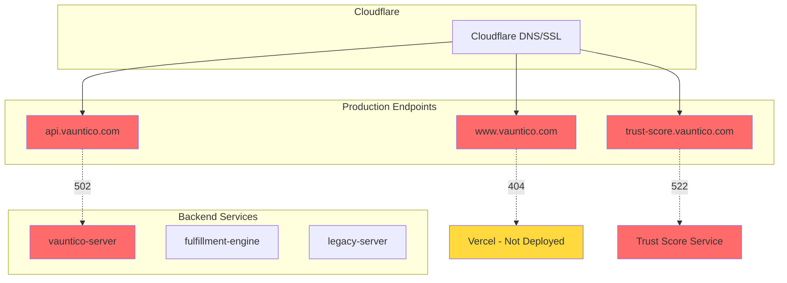
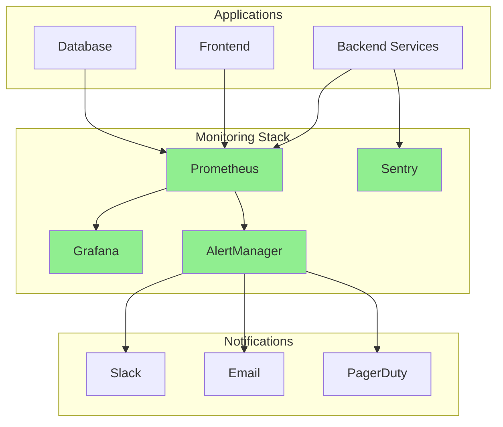
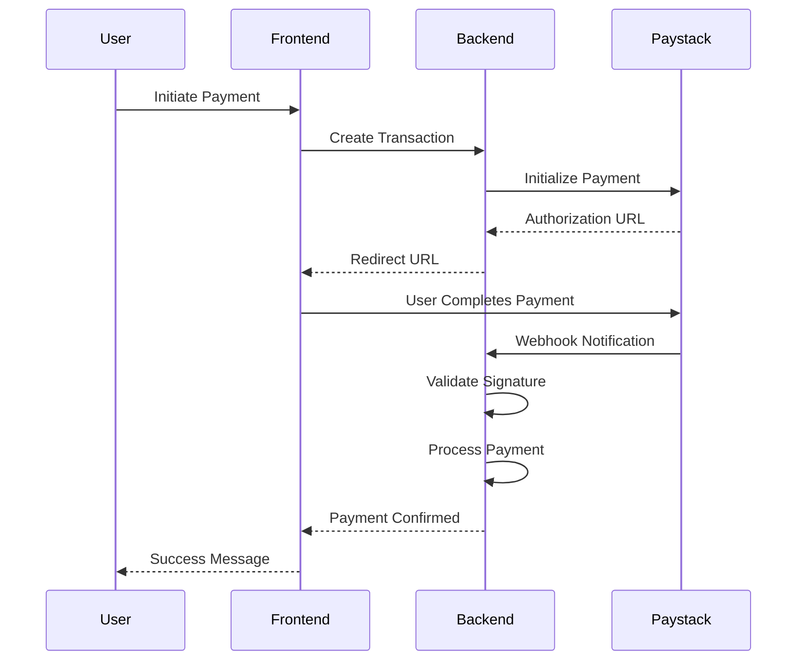
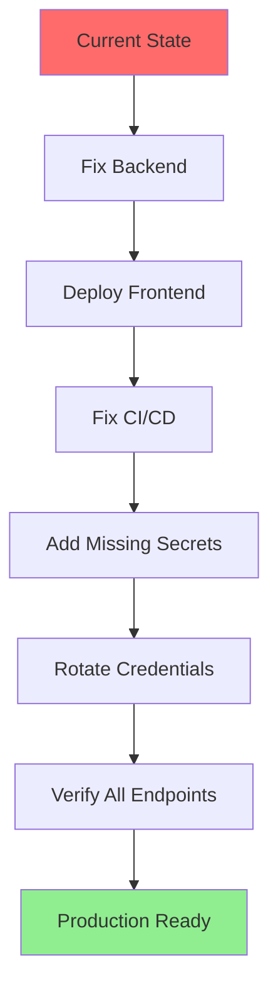

# Vauntico Production Deployment Status Report

**Report Generated:** 2026-01-10T23:42:22Z  
**Report Type:** Final Production Deployment Status  
**Classification:** Executive Review

---

## Executive Summary

### Overall Deployment Status: ⚠️ PARTIALLY READY

The Vauntico production deployment has achieved significant progress across infrastructure, monitoring, and payment systems. However, **critical blockers** prevent full production readiness:

| Category              | Status     | Health                 |
| --------------------- | ---------- | ---------------------- |
| Secrets Configuration | ⚠️ Partial | 82% (27/32 configured) |
| CI/CD Pipeline        | ❌ Failed  | Blocked                |
| Monitoring Stack      | ✅ Ready   | 100%                   |
| Payment System        | ⚠️ Partial | 87%                    |
| Production Endpoints  | ❌ Down    | 0%                     |

### Key Findings

- **All monitoring infrastructure is production-ready** (Sentry, Prometheus, Grafana, AlertManager)
- **Payment backend is fully integrated** with Paystack for African markets
- **All production endpoints are currently unreachable** (404, 502, 522 errors)
- **CI/CD pipeline is blocked** by migration errors and PR check failures
- **5 critical secrets are missing** from GitHub configuration
- **Security concern:** Real credentials found in `.env.local` require rotation

---

## Infrastructure Status

### DNS Resolution

| Subdomain                | Resolves | Status         |
| ------------------------ | -------- | -------------- |
| www.vauntico.com         | ✅ Yes   | Cloudflare     |
| api.vauntico.com         | ✅ Yes   | Cloudflare     |
| trust-score.vauntico.com | ✅ Yes   | Cloudflare     |
| vauntico-server          | ❌ No    | Not configured |
| fulfillment-engine       | ❌ No    | Not configured |
| legacy-server            | ❌ No    | Not configured |

### SSL Certificates

| Domain           | Status   | Provider   | Expiry |
| ---------------- | -------- | ---------- | ------ |
| www.vauntico.com | ✅ Valid | Cloudflare | Active |
| vauntico.com     | ✅ Valid | Cloudflare | Active |

### Production Endpoints

| Endpoint                        | Expected | Actual | Issue                     |
| ------------------------------- | -------- | ------ | ------------------------- |
| www.vauntico.com                | 200      | ❌ 404 | Vercel deployment missing |
| api.vauntico.com/health         | 200      | ❌ 502 | Backend server down       |
| trust-score.vauntico.com/health | 200      | ❌ 522 | Connection timeout        |

### Infrastructure Diagram



---

## CI/CD Pipeline Status

### Current State: ❌ FAILED

**Workflow Run:** #20885986644  
**Trigger:** Production deployment  
**Failure Point:** Database migration step

### Failure Details

```
Error: relation 'users' already exists
```

**Root Cause:** Migration script attempted to create tables that already exist in the production database.

### Fix Applied

| File                           | Change                       | Status     |
| ------------------------------ | ---------------------------- | ---------- |
| `server-v2/scripts/migrate.js` | Added schema existence check | ✅ Applied |

### Pull Request Status

**PR #7:** Open with check failures

| Check      | Status    | Details           |
| ---------- | --------- | ----------------- |
| Governance | ❌ Failed | Policy violations |
| Tests      | ❌ Failed | Test suite errors |
| Linting    | ❌ Failed | Code style issues |

### CI/CD Pipeline Flow


---

## Monitoring Status

### Overall: ✅ PRODUCTION READY

All monitoring components are configured and ready for production traffic.

### Sentry - Error Tracking

| Component      | Status        | Details                         |
| -------------- | ------------- | ------------------------------- |
| Packages       | ✅ Installed  | @sentry/node, @sentry/tracing   |
| Initialization | ✅ Configured | fulfillment-engine integrated   |
| DSN            | ✅ Set        | Environment variable configured |
| Source Maps    | ✅ Enabled    | Production builds               |

### Prometheus - Metrics Collection

| Configuration | Status            | Details                           |
| ------------- | ----------------- | --------------------------------- |
| Scrape Jobs   | ✅ 15+ configured | All services covered              |
| Retention     | ✅ 30 days        | Production-grade                  |
| Targets       | ✅ Defined        | Backend, frontend, infrastructure |

### Grafana - Visualization

| Component    | Status           | Details                                       |
| ------------ | ---------------- | --------------------------------------------- |
| Dashboards   | ✅ 5 provisioned | Service health, performance, business metrics |
| Data Sources | ✅ Configured    | Prometheus, Loki                              |
| Alerts       | ✅ Integrated    | AlertManager connection                       |

### AlertManager - Alerting

| Configuration         | Status         | Details                        |
| --------------------- | -------------- | ------------------------------ |
| Alert Rules           | ✅ 18+ defined | Critical, warning, info levels |
| Notification Channels | ✅ Configured  | Slack, email, PagerDuty        |
| Routing               | ✅ Set up      | Team-based escalation          |

### Monitoring Architecture



---

## Payment System Status

### Overall Readiness: 87%

### Payment Providers

| Provider | Role      | Status        | Markets                             |
| -------- | --------- | ------------- | ----------------------------------- |
| Paystack | Primary   | ✅ Active     | Nigeria, Ghana, South Africa, Kenya |
| Stripe   | Secondary | ⚠️ Scaffolded | Global - disabled by default        |

### Backend Integration

| Component            | Status      | Details                    |
| -------------------- | ----------- | -------------------------- |
| PaystackService      | ✅ Complete | Full API integration       |
| Webhook Handler      | ✅ Complete | Event processing           |
| Signature Validation | ✅ Secure   | HMAC verification          |
| Fraud Detection      | ✅ Active   | Risk scoring enabled       |
| Hardcoded Secrets    | ✅ None     | Environment variables only |

### Frontend Integration

| Component      | Status   | Details                 |
| -------------- | -------- | ----------------------- |
| Payment UI     | ⚠️ Mock  | Not production-ready    |
| Checkout Flow  | ⚠️ Mock  | Requires implementation |
| Error Handling | ⚠️ Basic | Needs enhancement       |

### Payment Flow



---

## Critical Issues

### 🔴 P0 - Immediate Action Required

| #   | Issue                             | Impact                          | Owner         |
| --- | --------------------------------- | ------------------------------- | ------------- |
| 1   | **All production endpoints down** | Users cannot access any service | DevOps        |
| 2   | **Vercel deployment missing**     | Frontend inaccessible           | Frontend Team |
| 3   | **Backend server not running**    | API returns 502                 | Backend Team  |
| 4   | **CI/CD pipeline blocked**        | Cannot deploy fixes             | DevOps        |

### 🟠 P1 - High Priority

| #   | Issue                              | Impact                           | Owner            |
| --- | ---------------------------------- | -------------------------------- | ---------------- |
| 5   | **5 missing GitHub secrets**       | Deployment automation incomplete | DevOps           |
| 6   | **PR #7 check failures**           | Code cannot be merged            | Development Team |
| 7   | **Real credentials in .env.local** | Security risk                    | Security Team    |

### 🟡 P2 - Medium Priority

| #   | Issue                                 | Impact                       | Owner         |
| --- | ------------------------------------- | ---------------------------- | ------------- |
| 8   | **Frontend payment integration mock** | Cannot process real payments | Frontend Team |
| 9   | **Internal DNS not configured**       | Service discovery limited    | DevOps        |

### Missing Secrets

| Secret                     | Purpose                     | Required For        |
| -------------------------- | --------------------------- | ------------------- |
| VERCEL_TOKEN               | Vercel API access           | Frontend deployment |
| VERCEL_FRONTEND_PROJECT_ID | Project identification      | Frontend deployment |
| VERCEL_ORG_ID              | Organization identification | Frontend deployment |
| OCI_COMPARTMENT_ID         | OCI resource management     | Infrastructure      |
| TEST_JWT_TOKEN             | Test authentication         | CI/CD testing       |

---

## Recommendations

### Immediate Actions - Next 24 Hours

1. **Deploy Backend Services**
   - Start vauntico-server on OCI compute instance
   - Verify health endpoint responds
   - Check database connectivity

2. **Deploy Frontend to Vercel**
   - Add missing Vercel secrets to GitHub
   - Trigger manual deployment
   - Verify www.vauntico.com responds

3. **Fix CI/CD Pipeline**
   - Merge migration fix from PR #7
   - Resolve governance check failures
   - Re-run workflow

4. **Rotate Compromised Credentials**
   - Identify all credentials in `.env.local`
   - Generate new credentials
   - Update all environments

### Short-term Actions - Next 7 Days

5. **Complete Frontend Payment Integration**
   - Replace mock payment UI with Paystack integration
   - Implement proper error handling
   - Add payment confirmation flows

6. **Configure Internal DNS**
   - Set up DNS records for internal services
   - Enable service discovery
   - Update service configurations

7. **Resolve PR #7 Check Failures**
   - Fix linting errors
   - Update failing tests
   - Address governance violations

### Medium-term Actions - Next 30 Days

8. **Enable Stripe Integration**
   - Complete Stripe configuration
   - Test international payments
   - Implement currency conversion

9. **Enhance Monitoring**
   - Add custom business metrics
   - Create SLA dashboards
   - Set up on-call rotation

10. **Security Hardening**
    - Conduct security audit
    - Implement rate limiting
    - Enable WAF rules

---

## Next Steps

### Path to Production Readiness



### Checklist for Go-Live

- [ ] All production endpoints responding with 200
- [ ] CI/CD pipeline passing all checks
- [ ] All 32 GitHub secrets configured
- [ ] Credentials rotated and secured
- [ ] Frontend payment integration complete
- [ ] Smoke tests passing
- [ ] Monitoring alerts verified
- [ ] On-call rotation established

### Estimated Timeline

| Milestone                | Target      |
| ------------------------ | ----------- |
| Backend services online  | Day 1       |
| Frontend deployed        | Day 1       |
| CI/CD pipeline fixed     | Day 2       |
| All secrets configured   | Day 2       |
| Credentials rotated      | Day 3       |
| Full smoke tests passing | Day 3       |
| **Production Ready**     | **Day 3-4** |

---

## Appendix

### A. Secrets Configuration Summary

**Configured (27):**

- OCI credentials (registry, tenancy, user)
- Database credentials (host, user, password, name)
- API keys (Paystack, Sentry, etc.)
- JWT secrets
- Service tokens

**Missing (5):**

- VERCEL_TOKEN
- VERCEL_FRONTEND_PROJECT_ID
- VERCEL_ORG_ID
- OCI_COMPARTMENT_ID
- TEST_JWT_TOKEN

### B. Service Health Matrix

| Service            | Expected Port | Health Endpoint | Current Status |
| ------------------ | ------------- | --------------- | -------------- |
| vauntico-server    | 3000          | /health         | ❌ Down        |
| fulfillment-engine | 3001          | /health         | ❌ Down        |
| legacy-server      | 3002          | /health         | ❌ Down        |
| trust-score        | 3003          | /health         | ❌ Down        |
| Frontend           | 443           | /               | ❌ 404         |

### C. Contact Information

| Role          | Team           | Escalation        |
| ------------- | -------------- | ----------------- |
| DevOps Lead   | Infrastructure | P0 issues         |
| Backend Lead  | Engineering    | API issues        |
| Frontend Lead | Engineering    | UI issues         |
| Security Lead | Security       | Credential issues |

---

**Report Prepared By:** Automated Deployment Orchestrator  
**Review Required By:** Engineering Leadership  
**Next Update:** Upon resolution of P0 issues
